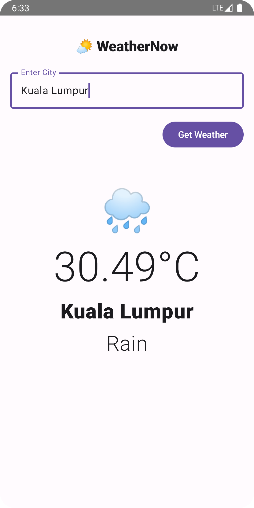

# 🌤 WeatherNow

**WeatherNow** is a modern Android weather app built with Jetpack Compose, Hilt for dependency injection, and Retrofit for networking.
It displays the current weather based on the city name entered by the user and uses OpenWeatherMap's free API.

---

## 🚀 Features

- 🔍 Search for weather by city
- 🌡️ View current temperature, weather condition & city name
- 🎨 Built using Jetpack Compose (Material 3)
- 🌈 Displays weather with matching Unicode weather icons
- 💉 Dependency Injection with Hilt
- 🌐 Network communication with Retrofit + OkHttp Logger
- ☁️ OpenWeatherMap API Integration

--- 

## 📸 Screenshot




---

## 🛠️ Tech Stack

- **Jetpack Compose**
- **Kotlin**
- **Hilt (DI)**
- **Retrofit & OkHttp**
- **Material 3**
- **MVVM Architecture**

---

## 📦 Setup & Installation

1. **Clone this repository:**

   ```bash
   git clone https://github.com/your-username/weathernow.git
   cd weathernow
